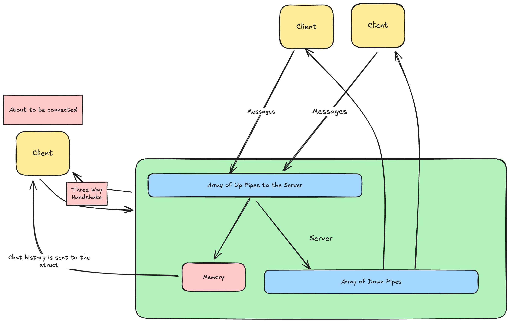

# Final Project Proposal

## Group Members:

Ivan Gontchar, Elias Xu, Ishaana Misra

# Intentions:

We are going to simulate a chat app. Users will be able to type and read messages in different channels, which can be read by other users in those channels.

# Intended usage:

The user will be put into the app, which will show them a list of all available channels they can message, and then a type prompt will be used to select which one they may want to enter. Once they choose a channel, they will be able to see a few lines of previous activity, and then they will be able to send a message in it. Others who have access to the channel can see the message and respond accordingly. A user can always type “exit” to return to the list of all channels and enter a different one. The user can always type “quit” to exit the app entirely or use ctrl-C, which has error handling that helps with exiting gracefully.

# Technical Details:

To have good communication between users, there must first be a “server” where all the messages can be piped to, which will then update all clients on the server. To do that, we’ll have to use the handshake that we learned about (however, we’ll not do the networking stuff across servers unless we magically find some more time to do so, so it’ll all be occurring on one computer).

For the appearance of the client side of the program, we try to make it have an interface, which will be created by continuously refreshing and then updated based on the size of the terminal. (For reference, check out these stack overflow posts regarding refreshing and determining the dimensions of the screen: How do you clear the console screen in [C? - Stack Overflow](https://stackoverflow.com/questions/2347770/how-do-you-clear-the-console-screen-in-c), Getting terminal width in [C? - Stack Overflow](https://stackoverflow.com/questions/1022957/getting-terminal-width-in-c))

# Topics

- Pipe networking
- Child processes
- Semaphores
- Possibly Shared Memory
- Executing commands (pseudo execvp), with argument parsing
- Input/Output
- Signals (probably)
- Structs

# Intended pacing:

A timeline with expected completion dates of parts of the project.

**Basic Structure**

**First stage**: basic chat functionality with one channel.

- Makefile targets (Elias)
- A Universal.h file that contains the parameters shared among the client and server (e.g., the WKP name) (Ivan)
- Handshake stuff (Ivan)
- Communication between servers and client (Ivan)
- Client
  - Create a basic interface for the client (refreshing interface with one channel) using ANSI escape (Elias)
  - Resize based on changing the terminal size (Elias)
- Server
- Taking the input from a user from a private pipe and then updating the struct containing that (Ishaana)
- Handling disconnect of client with closing (Ishaana)
- Handling Closing of Server and closing of clients (e.g., signals) (Ishaana)

**Second Stage**: changing channels

- Server
  - Child processes for each channel (Ivan)
  - Shared memory? (Ishaana)
  - Handle Channel creation and deletion commands (using special codes) (like the slash commands with discord) (Elias)
  - Updating struct so that it can work with multiple channels (Ishaana)
  - Create Server message log (Ishaana)
- Client
  - Colors, also updating the interface to use box characters (https://en.wikipedia.org/wiki/Box-drawing_characters)Commands that allow the user to list channels and switch between them (using special codes, slash commands) (Elias)

**Third Stage**: Bonus Round, if we have time
- Implementing clicks??!?!?
- Server
    - Admin panel for the server
- Client
    - Responding to messages
